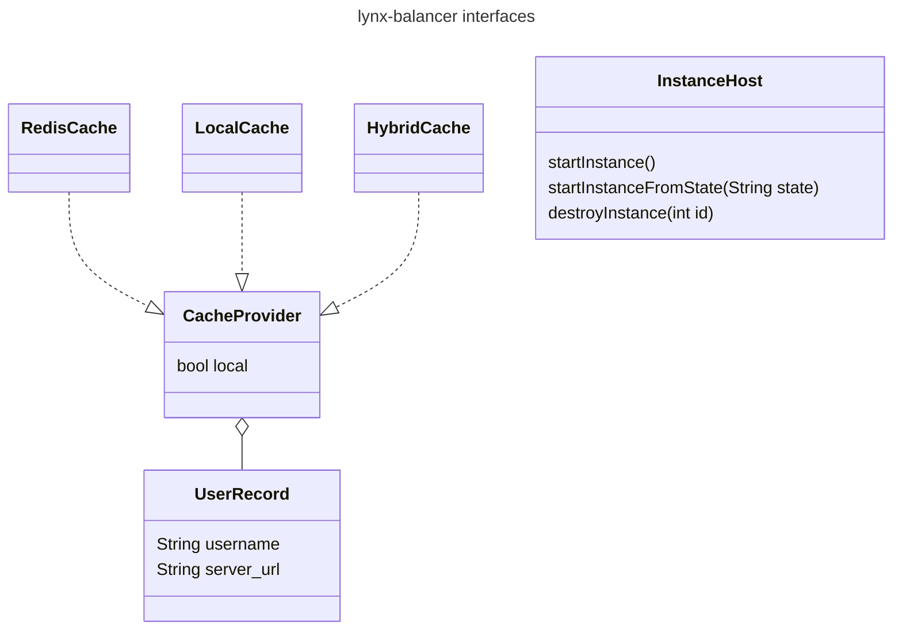

# lynx-balancer-docs
Documentation of load balancer designed for containerised stateful workflows

```mermaid
---
title: lynx-balancer interfaces
---
classDiagram
    class UserRecord{
        String username
        String server_url
    }
    class CacheProvider{
        bool local
    }
    class RedisCache{
    }
    class LocalCache{
    }
    class HybridCache{
    }
    RedisCache ..|> CacheProvider
    LocalCache ..|> CacheProvider
    HybridCache ..|> CacheProvider
    CacheProvider o-- UserRecord

    class InstanceHost{
      startInstance()
      startInstanceFromState(String state)
      destroyInstance(int id)
      
    }
```
